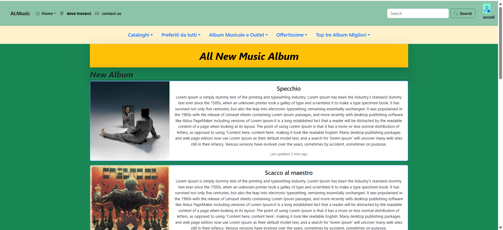
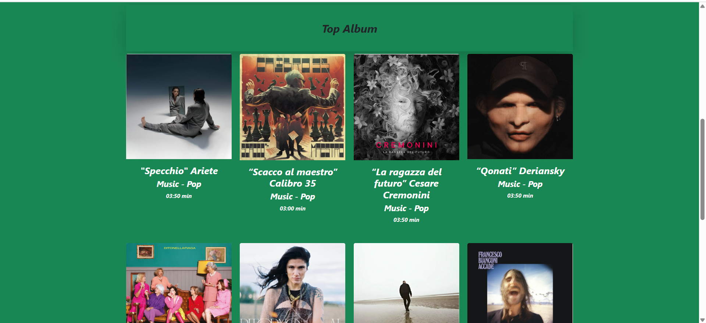

# 🎵 ALMusicAlbum — Album Musicale (Static Gallery)

Una piccola galleria musicale in HTML: copertine/immagini organizzate in pagina, con markup semplice e pronto da pubblicare.
La cartella album/ contiene le risorse grafiche (cover/foto).

**Guarda il sito live qui: [https://almusicalbum-alina.netlify.app/](https://almusicalbum-alina.netlify.app/)**

## Stack 

### Demo live  

https://alina-galben.github.io/ALMusicAlbum/

---
### 📚 Home Page   

<p align="center">
  
  
</p>

###
Cosa fa
- Mostra immagini/cover musicali in una pagina HTML unica.
- Struttura semplice e leggera, ideale come esercizio o mini-portfolio.
- Pronta per essere estesa (griglia responsive, didascalie, lightbox, ecc.).


### Come eseguirlo in locale
- Clona la repo:
```
git clone https://github.com/Alina-Galben/ALMusicAlbum.git
cd ALMusicAlbum
```
- Apri index.html nel browser (doppio click)  
oppure usa VS Code → estensione “Live Server” per il refresh automatico.

- Come aggiungere 3 screenshot della home nel README  
Crea una cartella screenshots/ e aggiungi tre immagini (home-1.png, home-2.png, home-3.png), poi incolla:  

- Personalizzazione rapida
Sostituisci le immagini dentro album/ con le tue cover/foto (usa nomi senza spazi).  
Se vuoi CSS esterno, crea style.css e linkalo in index.html:
```
<link rel="stylesheet" href="./style.css">
```
---

### Roadmap / Idee di miglioramento
- Griglia responsive (CSS Grid) con card uniformi.
- Lightbox per ingrandire le immagini.
- Filtri/Categorie (per genere, artista, anno).
- Lazy-loading delle immagini (loading="lazy").
- Tema scuro/chiaro con un semplice toggle.

## Note
Progetto per scopo didattico: marchi/immagini eventualmente ispirati a terze parti restano dei rispettivi proprietari.  


